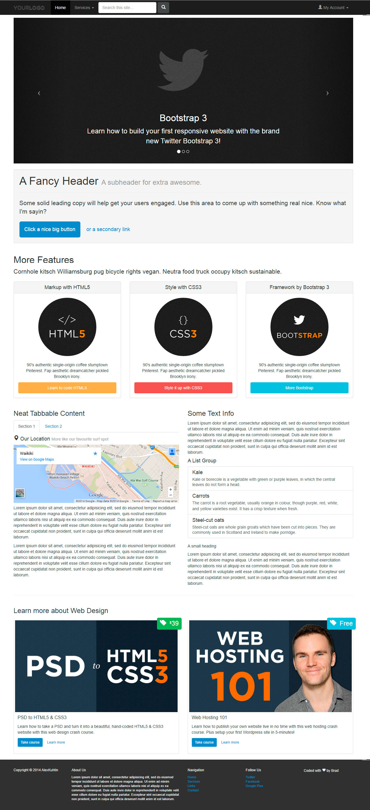

3.-Brad-Hussey
==============

Hello, everyone!
This site is created fully thanks Brad Hussey course! He show how could be used bootstrap and learned how to move forward after taken knowledge.
Site based only on bootstrap + a little bit jQuery code.
Structure as always easy:
1) index.html - Home page
2) include folder - styles/scripts/fonts
3) bootstrap folder - bootstrap styles/scripts
4) images folder - images

